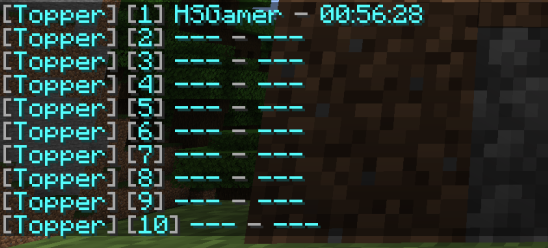
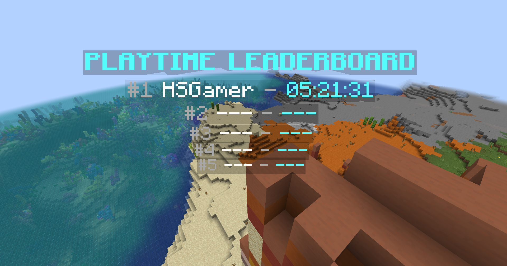

+++
title = "Playtime Leaderboard"
+++

This will guide you on how to create an ~unreliable~ playtime leaderboard for your server using the built-in [`Statistic Value Provider`]({}) and format the value using [`Value Display`]({}).

## Add the Holder

Open the `config.yml` file and add the following holder:

```yaml
holders:
  playtime:
    type: statistic
    statistic: PLAY_ONE_MINUTE # Or PLAY_ONE_TICK if your server is running on 1.12 or below
```

This will create a holder named `playtime` that shows the total playtime of a player in ticks.

But the value is in ticks, which is not human-readable. So, we need to format it. Add the following line:

```yaml
holders:
  playtime:
    type: statistic
    statistic: PLAY_ONE_MINUTE
    line: "&7[&b{index}&7] &b{name} &7- &b{value_time:pattern=HH:mm:ss&type=duration&unit=ticks}"
```

We added the `line` setting to the holder and override [the default `line`]({}). The `{value_time:pattern=HH:mm:ss&type=duration&unit=ticks}` will format the value to a human-readable time format.

Now when you save and restart the server, you should see the playtime leaderboard in the `/gettop playtime` command.



## Display the Leaderboard

We will [display it in a hologram]({})

Here is an example of a hologram that displays the top 5 players in the leaderboard:

```
&b&lPLAYTIME LEADERBOARD
&7#1 &f%topper_playtime;top_name;1% &7- &b%topper_playtime;top_value;1;time:pattern=HH:mm:ss&type=duration&unit=ticks%
&7#2 &f%topper_playtime;top_name;2% &7- &b%topper_playtime;top_value;2;time:pattern=HH:mm:ss&type=duration&unit=ticks%
&7#3 &f%topper_playtime;top_name;3% &7- &b%topper_playtime;top_value;3;time:pattern=HH:mm:ss&type=duration&unit=ticks%
&7#4 &f%topper_playtime;top_name;4% &7- &b%topper_playtime;top_value;4;time:pattern=HH:mm:ss&type=duration&unit=ticks%
&7#5 &f%topper_playtime;top_name;5% &7- &b%topper_playtime;top_value;5;time:pattern=HH:mm:ss&type=duration&unit=ticks%
```


