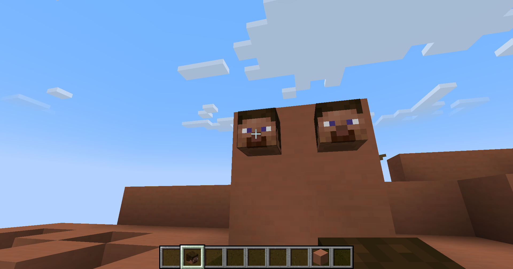
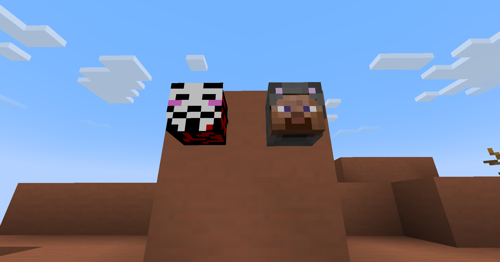
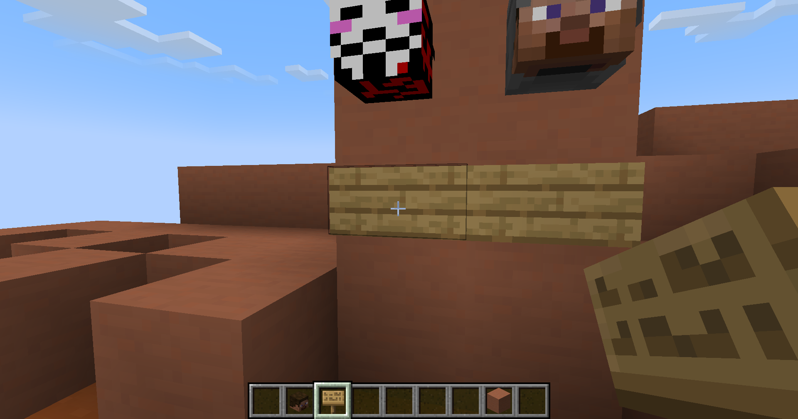
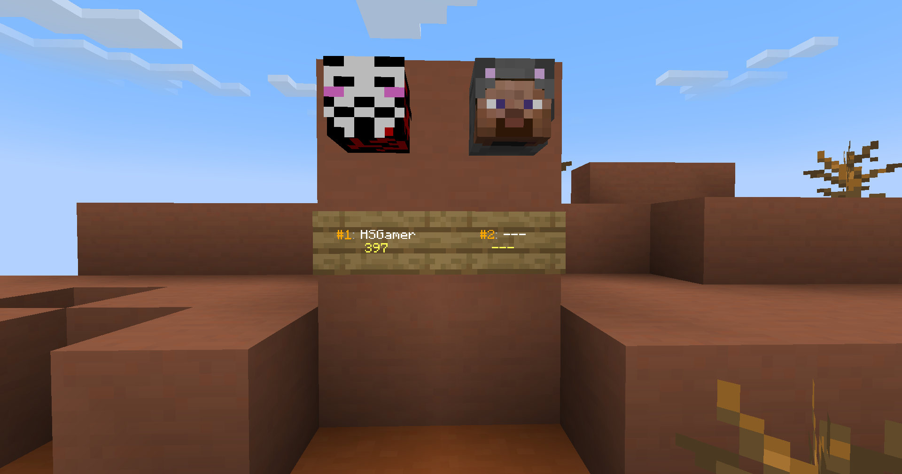

+++
title = "Create a Top Block"
+++

> [!NOTE]
> Requires [PlaceholderAPI](https://placeholderapi.com) and [VarBlocks](https://www.spigotmc.org/resources/varblocks.120327/)

## Create a Top Skull

1. Prepare a skull template named `jump_skull` that returns the UUID of the player at the specific `{index}` of the `jump` leaderboard
```
/varblocks template add jump_skull %topper_jump;top_key;{index}%
```

2. Place the skull


3. While looking at the skull, run the following command to assign the `jump_skull` template to the skull
```
/varblocks block add jump_1 skull jump_skull
```

4. Set the `{index}` of the skull to 1 to display the top player
```
/varblocks block argument jump_1 index 1
```

5. Create another skull for the second player
```
/varblocks block add jump_2 skull jump_skull
/varblocks block argument jump_2 index 2
```



## Create a Top Sign

1. Prepare a sign template named `jump_sign` that displays the player's name and value at the specific `{index}` of the `jump` leaderboard
```
/varblocks template add jump_sign
/varblocks template add jump_sign &6#{index}&7: &f%topper_jump;top_name;{index}%
/varblocks template add jump_sign &e%topper_jump;top_value;{index}%
/varblocks template add jump_sign
```

2. Place the sign


3. While looking at the sign, run the following command to assign the `jump_sign` template to the sign
```
/varblocks block add jump_sign_1 sign jump_sign
```

4. Set the `{index}` of the sign to 1 to display the top player
```
/varblocks block argument jump_sign_1 index 1
```

5. Create another sign for the second player
```
/varblocks block add jump_sign_2 sign jump_sign
/varblocks block argument jump_sign_2 index 2
```


