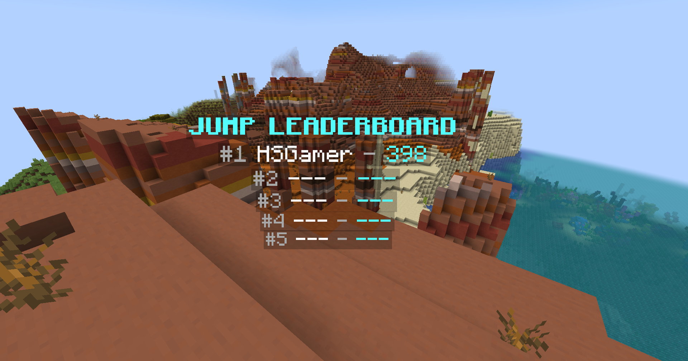

+++
title = "Create a Hologram"
+++


You can use the `top_name` and `top_value` placeholders to display players in the leaderboard.

Here is an example of a hologram that displays the top 5 players in the leaderboard:


{}
> [!NOTE]
> Requires [PlaceholderAPI](https://placeholderapi.com) and a hologram plugin that supports PlaceholderAPI such as [DecentHolograms](https://www.spigotmc.org/resources/decentholograms-1-8-1-21-1-papi-support-no-dependencies.96927/)

```
&b&lJUMP LEADERBOARD
&7#1 &f%topper_jump;top_name;1% &7- &b%topper_jump;top_value;1%
&7#2 &f%topper_jump;top_name;2% &7- &b%topper_jump;top_value;2%
&7#3 &f%topper_jump;top_name;3% &7- &b%topper_jump;top_value;3%
&7#4 &f%topper_jump;top_name;4% &7- &b%topper_jump;top_value;4%
&7#5 &f%topper_jump;top_name;5% &7- &b%topper_jump;top_value;5%
```
{}
{}
> [!NOTE]
> The placeholders are provided by [Text Placeholder API](https://modrinth.com/mod/placeholder-api)

```
<aqua><bold>JUMP LEADERBOARD
<gray>#1 <white>%topper:query jump;top_name;1% <gray>- <aqua>%topper:query jump;top_value;1%
<gray>#2 <white>%topper:query jump;top_name;2% <gray>- <aqua>%topper:query jump;top_value;2%
<gray>#3 <white>%topper:query jump;top_name;3% <gray>- <aqua>%topper:query jump;top_value;3%
<gray>#4 <white>%topper:query jump;top_name;4% <gray>- <aqua>%topper:query jump;top_value;4%
<gray>#5 <white>%topper:query jump;top_name;5% <gray>- <aqua>%topper:query jump;top_value;5%
```
{}




> [!NOTE]
> If you don't know what `top_name` and `top_value` are, you can find more information about them in the [Query]({}) section
